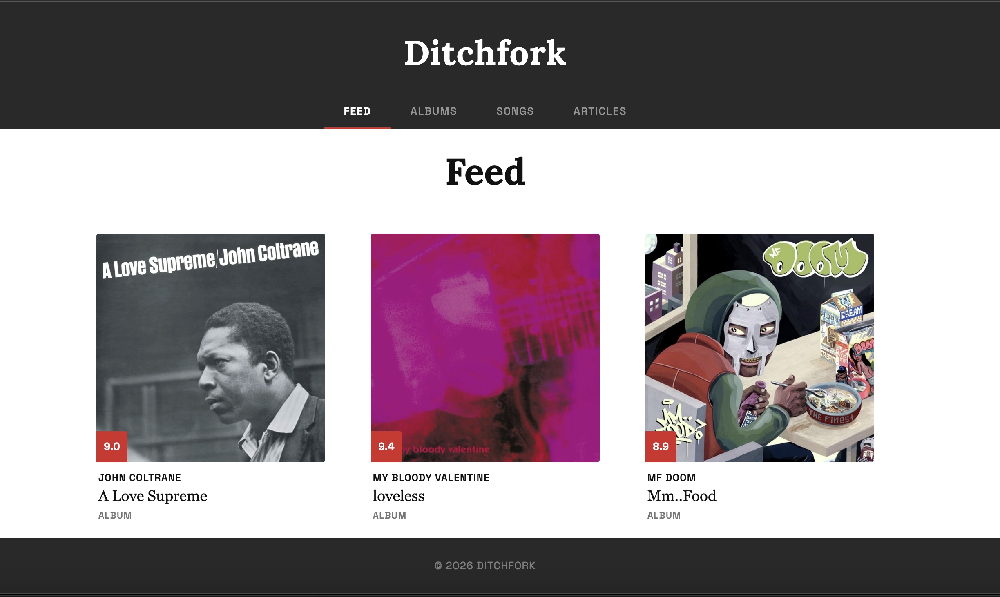
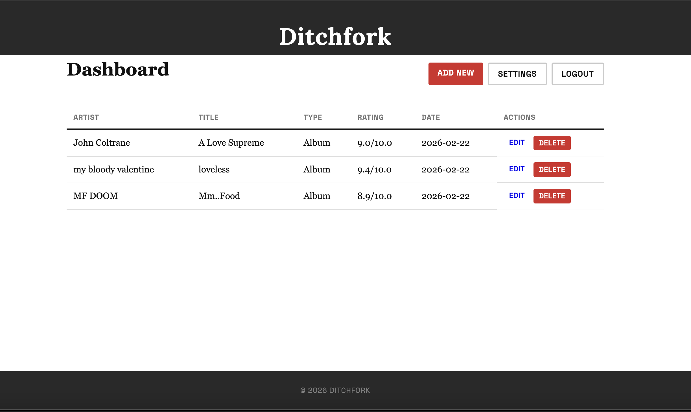
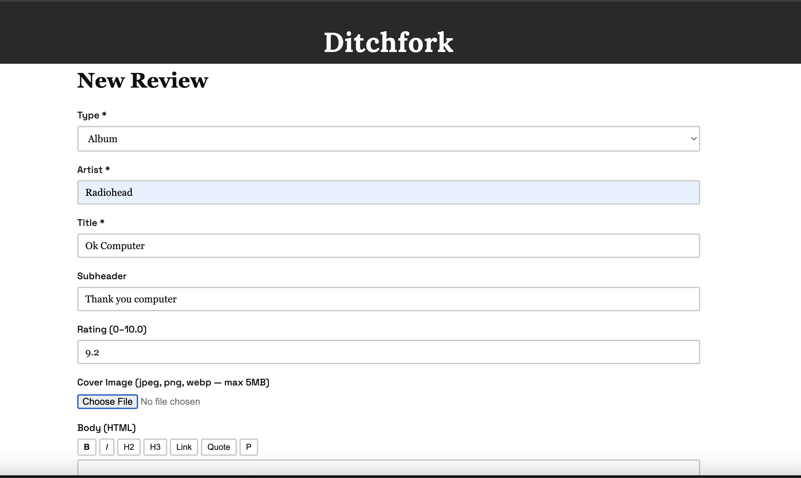

# Ditchfork

Pitchfork just became paywalled. Ditchfork enables you to create your own Pitchfork clone with an easy-to-use admin dashboard for uploading your own album reviews, song reviews, or articles. 

You have lightweight customization for colors and site name :)

No cloud accounts. No monthly fees. One file, runs anywhere.
Find installation and setup guide below.
Thank you to Claude Code for CICD and README.



---

## Quick start

### 1. Download

Go to the [Releases page](https://github.com/lawi22/ditchfork/releases/latest) and download the file for your system:

| System | File |
|---|---|
| Linux (most servers, x86) | `ditchfork-linux-amd64` |
| Raspberry Pi 4 / Pi 5 | `ditchfork-linux-arm64` |
| Raspberry Pi 2 / 3 | `ditchfork-linux-armv7` |
| Mac (Apple Silicon) | `ditchfork-darwin-arm64` |
| Mac (Intel) | `ditchfork-darwin-amd64` |
| Windows | `ditchfork-windows-amd64.exe` |

### 2. Run it

**Linux / Mac:**

```bash
# Make it executable (one time only)
chmod +x ditchfork-linux-amd64

# Run it
./ditchfork-linux-amd64
```

**Windows:** Double-click `ditchfork-windows-amd64.exe`, or run it in PowerShell.

### 3. Open your browser

Navigate to **http://localhost:8080** — you'll be guided through creating your admin account and naming your site.

That's it. You're running a music blog.

---

## Or use the install script (Linux only)

If you're on Linux and want Ditchfork installed as a background service automatically:

```bash
curl -fsSL https://raw.githubusercontent.com/lawi22/ditchfork/main/install.sh | sh
```

This downloads the right binary for your machine, installs it to `/usr/local/bin`, and (optionally) sets it up to start automatically with systemd.

### Updating

Run the same command again to update. The script detects your existing installation and handles it automatically — if you're running it as a service, it will swap the binary and restart with no further questions.

If you downloaded the binary manually, just download the new version from the [Releases page](https://github.com/lawi22/ditchfork/releases/latest) and replace the old file.

---

## What you get





Once you're logged in, you can:

- Write **album reviews** with ratings (out of 10), cover art, and rich text
- Write **song reviews** for individual tracks
- Write **articles** — tagged as News, Opinion, or List
- Customize your site title and color scheme from the Settings page

Everything is stored in a single SQLite file (`ditchfork.db`) next to the binary. Back it up to back up your whole blog.

---

## Configuration

Ditchfork works out of the box with no configuration. If you want to change defaults, set environment variables before running:

| Variable | Default | Description |
|---|---|---|
| `DITCHFORK_PORT` | `8080` | Port to listen on |
| `DITCHFORK_DB_PATH` | `./ditchfork.db` | Path to the database file |
| `DITCHFORK_UPLOAD_DIR` | `./uploads` | Where uploaded images are stored |

Example:

```bash
DITCHFORK_PORT=80 ./ditchfork-linux-amd64
```

Copy `.env.example` to `.env` if you want to use a file instead of inline variables (requires a tool like `dotenv` or a systemd `EnvironmentFile`).

---

## Keeping it running

### Simplest option: screen / tmux

```bash
screen -S ditchfork
./ditchfork-linux-amd64
# Press Ctrl+A then D to detach — it keeps running in the background
```

### As a systemd service (Linux)

Create `/etc/systemd/system/ditchfork.service`:

```ini
[Unit]
Description=Ditchfork music blog
After=network.target

[Service]
ExecStart=/usr/local/bin/ditchfork
WorkingDirectory=/var/lib/ditchfork
Restart=always
User=ditchfork

[Install]
WantedBy=multi-user.target
```

Then:

```bash
sudo systemctl daemon-reload
sudo systemctl enable --now ditchfork
```

---

## Building from source

You'll need [Go 1.22+](https://go.dev/dl/) installed.

```bash
git clone https://github.com/lawi22/ditchfork.git
cd ditchfork
make build
./ditchfork
```

To build for all platforms at once:

```bash
make dist
```

---

## License

MIT
